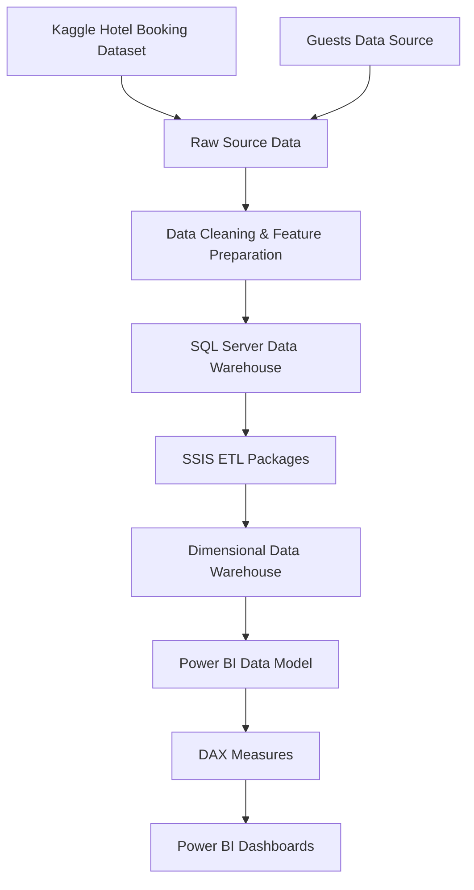
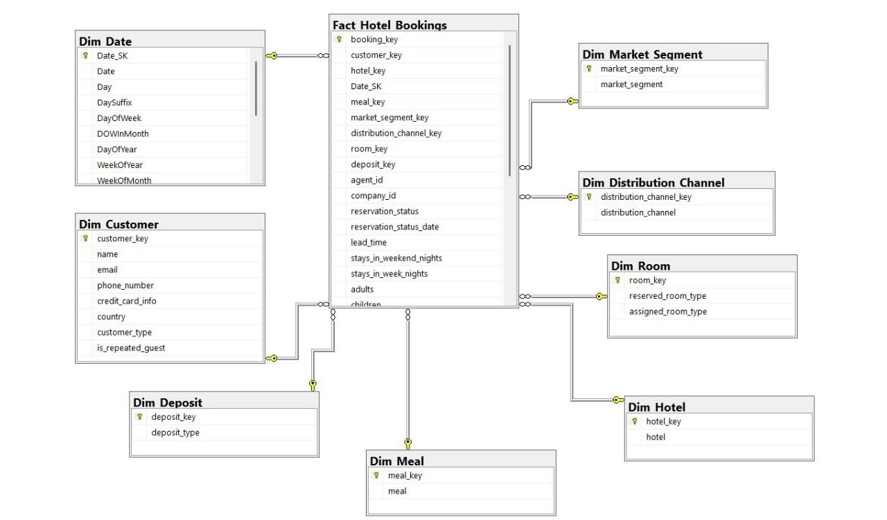
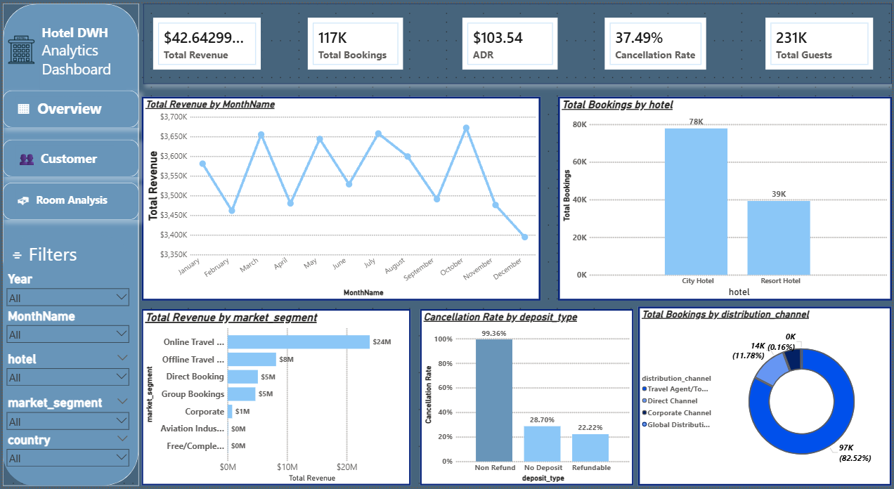
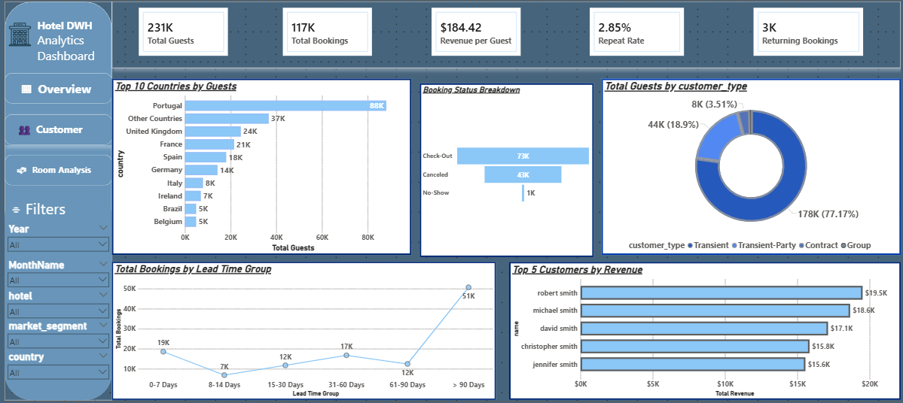
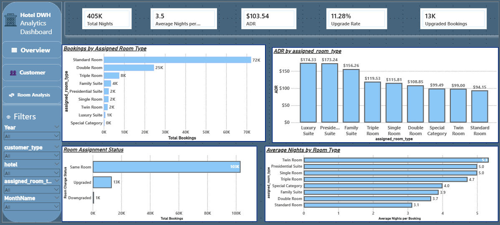

# 🏨 Hotel Bookings DWH Analytics Dashboard

[](#sql-server-data-warehouse)
[](#etl-process-using-ssis)
[](#power-bi-dashboards)
[](#dax-measures)
[](#data-warehouse-modeling)
[](#data-sources)

Welcome to the **Hotel Bookings DWH Analytics Dashboard** repository.  
This project is an end-to-end **Business Intelligence / Data Warehouse** solution for analyzing hotel booking performance using **SQL Server**, **SSIS**, and **Power BI**.

The project focuses on transforming raw hotel booking data into a clean analytical model, building a dimensional data warehouse, loading it through SSIS ETL packages, and designing interactive Power BI dashboards for business insights.

---

## 📌 Project Overview

This project analyzes hotel booking data to help answer important business questions such as:

- How is the hotel performing overall?
- What are the main revenue and booking trends?
- Which customer types and countries generate the highest demand?
- What is the cancellation behavior?
- Which room types are most booked?
- How do upgrades and downgrades affect room allocation?
- What are the best opportunities for pricing and operational improvement?

The project follows a complete BI workflow:

1. **Source Data Collection**  
   The raw data was collected from Kaggle and enhanced using an additional guest dataset.

2. **Data Cleaning & Preparation**  
   The source files were cleaned and prepared before loading into the data warehouse.

3. **Data Warehouse Modeling**  
   A star schema model was designed to support analytical reporting.

4. **ETL Development Using SSIS**  
   SSIS packages were built to extract, transform, and load data into the data warehouse.

5. **Power BI Dashboard Development**  
   Interactive dashboards were created to analyze overview performance, customer insights, and room analysis.

---

## 🎯 Business Goal

The main business goal is to help hotel management monitor performance and make better decisions using data.

The dashboards provide insights about:

- Revenue performance
- Booking volume
- Guest behavior
- Cancellation rate
- Customer segments
- Room type demand
- ADR and average stay duration
- Upgrade and downgrade behavior
- Distribution channels and deposit impact

---

## 🏗️ End-to-End Architecture



---

## 🛠️ Tools & Technologies

| Tool | Purpose |
|---|---|
| **SQL Server** | Store and manage the data warehouse |
| **SSMS** | Create tables and manage SQL Server database |
| **T-SQL** | Create and query data warehouse tables |
| **SSIS** | Build ETL packages and load data |
| **Visual Studio** | Develop SSIS packages |
| **Power BI** | Build interactive dashboards |
| **DAX** | Create business measures and KPIs |
| **Excel / CSV Files** | Store source and cleaned datasets |
| **Git & GitHub** | Version control and project documentation |

---

## 📂 Repository Structure

```text
Hotel-Bookings-DWH-Analytics-Dashboard/
│
├── Data_warehouse/
│   └── Data warehouse files / SQL Server related files
│
├── SSIS/
│   ├── Hotels_SSIS/
│   │   └── SSIS project files and packages
│   │
│   └── screenshot_packages/
│       ├── Dim_Customer Control_flow.png
│       ├── Dim_Customer Data_flow.png
│       ├── Dim_Deposit Control_flow.png
│       ├── Dim_Deposit DF.png
│       ├── Dim_Distribution_Channel CF.png
│       ├── Dim_Distribution_Channel DF.png
│       ├── DIM_HOTEL CF.png
│       ├── DIM_HOTEL DF.png
│       ├── DIM_MEAL CF.png
│       ├── DIM_MEAL DF.png
│       ├── Dim_Market_Segment CF.png
│       ├── Dim_Market_Segment DF.png
│       ├── Fact_Hotel_Bookings CF.png
│       └── Fact_Hotel_Bookings DF.png
│
├── clean_data/
│   └── Cleaned and prepared data files
│
├── modeling/
│   └── modeling_star_schema.jpg
│
├── powerBI/
│   ├── dashboards.pbix
│   │
│   └── screen_dashboard/
│       ├── overview_dashboard.png
│       ├── customers_dashboard.png
│       └── Room_analysis_dashboard.png
│
├── source_data/
│   └── Raw source data files
│
├── LICENSE
└── README.md
```

---

<a id="data-sources"></a>

## 📊 Data Sources

The project uses two main source datasets:

| Source | Description |
|---|---|
| **Hotel Booking Dataset** | Main Kaggle dataset containing booking, hotel, reservation, room, customer, deposit, and cancellation information |
| **Guests Dataset** | Additional dataset used to enrich the analysis with guest-related features |

### Source Data Folder

```text
source_data/
```

This folder contains the original raw files before cleaning and transformation.

### Clean Data Folder

```text
clean_data/
```

This folder contains the cleaned and prepared files after data cleaning and feature preparation.

---

<a id="data-warehouse-modeling"></a>

## 🧩 Data Warehouse Modeling

The data warehouse was designed using a **Star Schema** model.

The model contains one main fact table for hotel bookings and multiple dimensions for descriptive analysis.

### Star Schema



### Main Design Concepts

- **Fact table** stores measurable booking events.
- **Dimension tables** store descriptive information such as customer, date, room, hotel, deposit, and market segment.
- **Surrogate keys** are used to connect fact and dimension tables.
- **Star Schema** makes reporting easier and improves analytical performance.
- The model supports slicing and filtering by year, month, hotel, customer type, room type, market segment, and country.

---

<a id="sql-server-data-warehouse"></a>

## 🗄️ SQL Server Data Warehouse

SQL Server was used to store the analytical data warehouse.

The data warehouse includes:

| Table | Purpose |
|---|---|
| `Fact_Hotel_Bookings` | Stores hotel booking transactions and numeric measures |
| `Dim_Date` | Stores date attributes such as year and month |
| `Dim_Customer` | Stores customer and guest-related attributes |
| `Dim_Hotel` | Stores hotel type information |
| `Dim_Room` | Stores reserved and assigned room types |
| `Dim_Deposit` | Stores deposit type information |
| `Dim_Distribution_Channel` | Stores booking channel information |
| `Dim_Market_Segment` | Stores market segment information |

---

<a id="etl-process-using-ssis"></a>

## 🔄 ETL Process Using SSIS

SSIS was used to build the ETL pipeline.

The ETL process includes:

1. Extracting data from cleaned source files.
2. Applying transformations and data type handling.
3. Loading dimension tables.
4. Loading the fact table.
5. Mapping foreign keys between dimensions and the fact table.
6. Preparing the warehouse for Power BI analysis.

### CF vs DF Meaning

| Abbreviation | Meaning |
|---|---|
| **CF** | Control Flow — shows the high-level SSIS package execution steps |
| **DF** | Data Flow — shows the actual data movement, cleaning, transformation, and loading steps |

---

## 🧱 SSIS Packages

| Package / Table | Control Flow Screenshot | Data Flow Screenshot |
|---|---|---|
| `Dim_Customer` | `Dim_Customer Control_flow.png` | `Dim_Customer Data_flow.png` |
| `Dim_Deposit` | `Dim_Deposit Control_flow.png` | `Dim_Deposit DF.png` |
| `Dim_Distribution_Channel` | `Dim_Distribution_Channel CF.png` | `Dim_Distribution_Channel DF.png` |
| `Dim_Hotel` | `DIM_HOTEL CF.png` | `DIM_HOTEL DF.png` |
| `Dim_Meal` | `DIM_MEAL CF.png` | `DIM_MEAL DF.png` |
| `Dim_Market_Segment` | `Dim_Market_Segment CF.png` | `Dim_Market_Segment DF.png` |
| `Fact_Hotel_Bookings` | `Fact_Hotel_Bookings CF.png` | `Fact_Hotel_Bookings DF.png` |

---

## 🖼️ SSIS Screenshots

All SSIS screenshots are stored under:

```text
SSIS/screenshot_packages/
```

<details>
<summary><strong>View SSIS Package Screenshots</strong></summary>

### Dim Customer - Control Flow


### Dim Customer - Data Flow


### Dim Deposit - Control Flow


### Dim Deposit - Data Flow


### Dim Distribution Channel - Control Flow


### Dim Distribution Channel - Data Flow


### Dim Hotel - Control Flow


### Dim Hotel - Data Flow


### Dim Meal - Control Flow


### Dim Meal - Data Flow


### Dim Market Segment - Control Flow


### Dim Market Segment - Data Flow


### Fact Hotel Bookings - Control Flow


### Fact Hotel Bookings - Data Flow


</details>

---

<a id="dax-measures"></a>

## 🧮 DAX Measures

Power BI DAX measures were created to calculate dynamic KPIs that change automatically with filters.

### Main Measures

| Measure | Meaning |
|---|---|
| **Total Revenue** | Total hotel revenue |
| **Total Bookings** | Total number of bookings |
| **Total Guests** | Total number of guests |
| **ADR** | Average Daily Rate, average revenue per night |
| **Cancellation Rate** | Percentage of cancelled bookings |
| **Cancelled Bookings** | Number of cancelled bookings |
| **Confirmed Bookings** | Number of completed / non-cancelled bookings |
| **Revenue per Booking** | Average revenue generated per booking |
| **Revenue per Guest** | Average revenue generated per guest |
| **Revenue per Night** | Average revenue per night |
| **Average Lead Time** | Average number of days between booking date and arrival date |
| **Average Nights per Booking** | Average stay duration per booking |
| **Total Nights** | Total number of nights stayed |
| **Total Week Nights** | Total week nights |
| **Total Weekend Nights** | Total weekend nights |
| **Upgrade Rate** | Percentage of bookings assigned to a better room than reserved |
| **Downgrade Rate** | Percentage of bookings assigned to a lower room than reserved |
| **Upgraded Bookings** | Number of upgraded bookings |
| **Downgraded Bookings** | Number of downgraded bookings |
| **Returning Bookings** | Number of bookings from returning guests |
| **Repeat Rate** | Percentage of repeated / returning bookings |
| **Total Special Requests** | Total number of special requests |
| **Total Parking Spaces** | Total required parking spaces |

---

<a id="power-bi-dashboards"></a>

## 📈 Power BI Dashboards

The Power BI report contains three dashboards:

1. **Hotel Bookings Overview**
2. **Customer Insights Overview**
3. **Room Analysis Overview**

Power BI file:

```text
powerBI/dashboards.pbix
```

Dashboard screenshots:

```text
powerBI/screen_dashboard/
```

---

## 📌 Dashboard 1: Hotel Bookings Overview

This dashboard gives a high-level executive summary of hotel performance.



### Main KPIs

- **Total Revenue**
- **Total Bookings**
- **ADR**
- **Cancellation Rate**
- **Total Guests**

### Main Visuals

| Visual | Business Question |
|---|---|
| **Total Revenue by MonthName** | Which months generated the highest revenue? |
| **Total Bookings by Hotel** | Which hotel type has more bookings? |
| **Total Revenue by Market Segment** | Which market segment drives more revenue? |
| **Cancellation Rate by Deposit Type** | Which deposit type has the highest cancellation rate? |
| **Total Bookings by Distribution Channel** | Which booking channels bring the most bookings? |

### Key Insights

- Helps monitor revenue and booking performance quickly.
- Shows the relationship between deposit type and cancellation.
- Identifies the most important market segments and booking channels.
- Supports decisions related to pricing, marketing, and cancellation policies.

---

## 👥 Dashboard 2: Customer Insights Overview

This dashboard focuses on customer behavior and guest segmentation.



### Main KPIs

- **Total Guests**
- **Total Bookings**
- **Revenue per Guest**
- **Repeat Rate**
- **Returning Bookings**

### Main Visuals

| Visual | Business Question |
|---|---|
| **Top 10 Countries by Guests** | Which countries bring the highest number of guests? |
| **Booking Status Breakdown** | How many bookings were completed, cancelled, or no-show? |
| **Total Guests by Customer Type** | What are the main customer types? |
| **Total Bookings by Lead Time Group** | How early do customers usually book? |
| **Total Bookings by Distribution Channel** | Which channels are most used by customers? |
| **Top 5 Customers by Revenue** | Who are the highest value customers? |

### Key Insights

- Helps understand where guests come from.
- Explains customer booking behavior.
- Shows customer type distribution.
- Highlights repeat behavior and customer value.
- Supports marketing and customer retention decisions.

---

## 🛏️ Dashboard 3: Room Analysis Overview

This dashboard focuses on room performance, room allocation, and stay behavior.



### Main KPIs

- **Total Nights**
- **Average Nights per Booking**
- **ADR**
- **Upgrade Rate**
- **Upgraded Bookings**

### Main Visuals

| Visual | Business Question |
|---|---|
| **Bookings by Assigned Room Type** | Which room types are assigned the most? |
| **ADR by Assigned Room Type** | Which room types have the highest average daily rate? |
| **Room Assignment Status** | How many bookings stayed in the same room type, got upgraded, or got downgraded? |
| **Average Nights by Room Type** | Which room types have longer average stays? |

### Key Insights

- Shows the most demanded room types.
- Helps compare room prices using ADR.
- Identifies upgrade and downgrade behavior.
- Supports decisions about room allocation, pricing, and availability planning.

---

## 🔎 Filters / Slicers

The dashboards include interactive filters such as:

| Filter | Purpose |
|---|---|
| **Year** | Analyze performance by year |
| **MonthName** | Analyze monthly trends |
| **Hotel** | Compare City Hotel vs Resort Hotel |
| **Market Segment** | Analyze different market segments |
| **Country** | Filter customer origin |
| **Customer Type** | Analyze customer groups |
| **Assigned Room Type** | Analyze room performance |

---

## ✅ Key Features

- End-to-end BI project from raw data to dashboard.
- Kaggle source data enriched with guest data.
- Data cleaning and feature preparation.
- SQL Server data warehouse implementation.
- Star schema dimensional model.
- SSIS ETL packages for dimensions and fact table.
- Control Flow and Data Flow screenshots documented.
- Power BI dashboards with KPI cards, filters, and business visuals.
- DAX measures for dynamic calculations.
- Clean GitHub repository structure with screenshots and documentation.

---

## 📌 Business Insights Provided

This project helps answer:

- What is the overall hotel performance?
- Which months generate the highest revenue?
- Which hotel type gets more bookings?
- Which market segment brings more revenue?
- Which deposit type is linked to higher cancellation?
- Which distribution channel brings more bookings?
- Which countries bring the most guests?
- Which customer types are dominant?
- How early do customers book?
- Which room types are assigned most?
- Which room types have higher ADR?
- What is the upgrade and downgrade rate?

---

## 🎯 Skills Demonstrated

- Data Warehouse Design
- Star Schema Modeling
- SQL Server Development
- T-SQL
- SSIS ETL Development
- Control Flow & Data Flow Design
- Data Cleaning
- Feature Engineering
- Surrogate Key Mapping
- Power BI Dashboard Design
- DAX Measures
- Business Intelligence Reporting
- Data Storytelling
- GitHub Documentation

---

## 🚀 How to Use This Project

### 1. Clone the Repository

```bash
git clone https://github.com/Gehad-Hany/Hotel-Bookings-DWH-Analytics-Dashboard.git
```

### 2. Open the Data Warehouse Files

Use **SQL Server Management Studio** to create or review the data warehouse structure.

### 3. Open SSIS Project

Open the SSIS solution from:

```text
SSIS/Hotels_SSIS/
```

Then run the packages in the correct order:

1. Dimension packages
2. Fact table package

### 4. Open Power BI Dashboard

Open the Power BI file:

```text
powerBI/dashboards.pbix
```

Refresh the data source connection if needed.

---

## 🔮 Future Enhancements

- Add SQL scripts for full automated warehouse creation.
- Add incremental loading instead of full refresh.
- Add more data quality validation checks.
- Add a dashboard page for cancellation prediction insights.
- Add drill-through pages in Power BI.
- Publish the dashboard to Power BI Service.
- Add more advanced DAX measures for revenue and occupancy analysis.

---

## 🌟 About Me

Hi, I'm **Maiven Daniel Sobhy**.  
I am interested in **Data Engineering**, **ETL Pipelines**, **Data Warehousing**, and **Business Intelligence**.

This project demonstrates my ability to clean data, design a data warehouse, build ETL pipelines using SSIS, and create business dashboards using Power BI.

[](https://www.linkedin.com/in/maiven-daniel-b29223315/)
[](https://github.com/maiven-daniel)

---

## 📄 License

This project is licensed under the **MIT License**.
